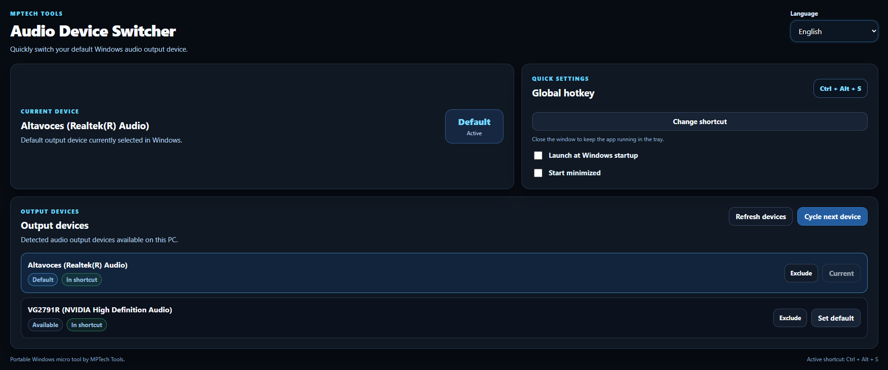

# Audio Device Switcher

## Portable Windows utility to quickly switch audio output devices.

---

## Overview

Audio Device Switcher is part of **MPTech Windows Tools**, a collection of small utilities focused on practical technical use cases.

Official website:

https://mptechsolutions.es

---

## Problem It Solves

Switching between speakers, headphones, monitors and audio interfaces in Windows can be slow and annoying.

---

## Who It Is For

Windows users, streamers, technicians and power users with multiple audio devices.

---

## Features

- List available audio output devices
- Switch active output device
- Simple desktop interface
- Portable executable
- Designed for fast daily use

---

## Screenshots

### Audio Device Switcher

## Download

Latest release:

https://github.com/xml2811/Audio-switcher/releases/latest

Download only from official sources:

- https://github.com/xml2811/Audio-switcher
- https://mptechsolutions.es

---

## Installation

This tool is designed as a portable Windows executable.

General usage:

1. Download the latest .exe from Releases.
2. Place it in any folder.
3. Run it.

No installer is required unless a future release adds one.

---

## Security Notice

Early releases may not be digitally signed yet.

Because of that, Windows SmartScreen may show a warning.

This does not automatically mean the file is malicious, but you should only download the tool from official sources.

Future improvements may include:

- SHA256 checksums
- Digital code signing
- Dedicated documentation
- Dedicated download page on MPTechSolutions

---

## Roadmap

Planned improvements may include:

- Better UI polish
- More diagnostics
- Better export options
- Multilanguage support
- Signed releases in the future
- Documentation on MPTechSolutions.es

---

## Related Links

| Resource | Link |
|---|---|
| Official Website | https://mptechsolutions.es |
| GitHub Profile | https://github.com/xml2811 |
| Windows Tools Catalog | https://github.com/xml2811/Windows-Tools |
| Repository | https://github.com/xml2811/Audio-switcher |
| Latest Release | https://github.com/xml2811/Audio-switcher/releases/latest |

---

## License

Check the repository license before using, modifying or redistributing this software.

